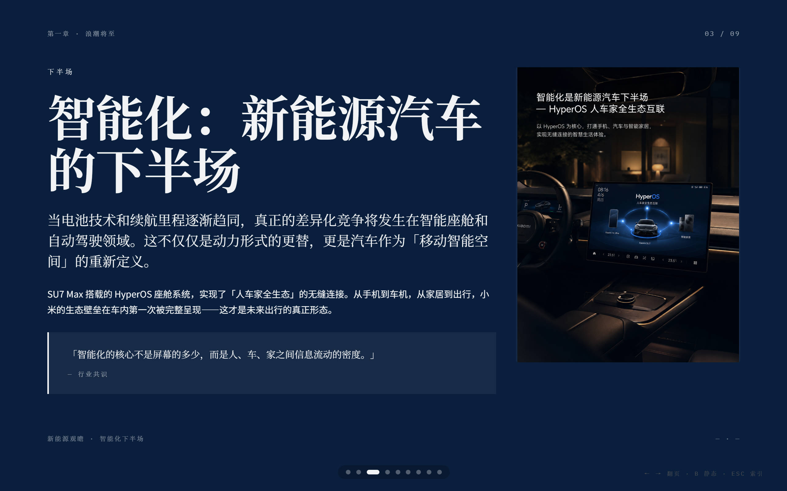
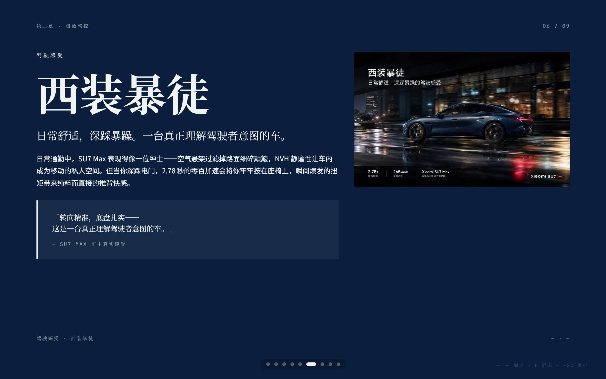

# 驶向电气化的未来 · 小米 SU7 Max 车主分享会 Web PPT

基于 `guizang-ppt-skill` 生成的高品质横向翻页网页 PPT，风格采用「电子杂志 x 电子墨水」美学，视觉气质对标《Monocle》/《NYT》。

## 页面展示





## 使用场景

本作品预设场景：用户参加小米汽车车友交流会，以演讲者身份向车友们讲解自己的 Xiaomi SU7 Max。内容分为三个章节——新能源观瞻、极致驾控、家庭与生活。

## 使用方式

1. 下载 `index.html` 和 `assets/` 文件夹，保持目录结构不变
2. 用浏览器（Chrome / Edge / Firefox 均可）打开 `index.html`
3. 按 **F11** 进入全屏模式
4. 使用 **← → 方向键**或**鼠标滚轮**横向翻页
5. 按 **B** 可在动态/静态模式间切换（低性能设备自动降级）
6. 按 **ESC** 可呼出全局索引视图
7. 演讲结束后按 **F11** 退出全屏

## 页面概览

共 9 页，分为三个章节：

| 章节 | 页号 | 内容 |
|------|------|------|
| **第一章：浪潮将至 — 新能源观瞻** | P1 | 封面：驶向电气化的未来 |
| | P2 | 数据大字报：燃油车是机械艺术的终点 |
| | P3 | 图文混排：智能化是新能源汽车的下半场 |
| **第二章：极致驾控 — SU7 Max 深度体验** | P4 | 章节幕封：性能与日常的双重奏 |
| | P5 | Pipeline 参数卡：核心配置 |
| | P6 | 左文右图：西装暴徒 — 驾驶感受 |
| **第三章：情感共鸣 — 家庭与生活** | P7 | 章节幕封：不仅是工具，更是家人 |
| | P8 | 大引用：「它降低的不是噪音，而是疲惫」 |
| | P9 | 图文混排：为什么选择 SU7 Max |

## 目录结构

```
index.html          # 主文件，包含全部 9 页内容、样式与交互逻辑
assets/
  motion.min.js     # Motion 动画引擎（WebGL 动效依赖）
  1.png             # P3 配图：HyperOS 智能座舱
  2.png             # P6 配图：SU7 Max 流线型车身
  3.png             # P9 配图：家庭出行 · 品质生活
页面展示1.jpg        # README 预览截图
页面展示2.jpg        # README 预览截图
制作要求.txt          # 原始设计需求文档
```

## 设计风格

| 维度 | 说明 |
|------|------|
| **整体美学** | 电子杂志 x 电子墨水，深色封面 + 纸白内页，留白与网格系统 |
| **主题色** | 靛蓝瓷（Indigo Porcelain），匹配科技与汽车发布场景 |
| **中文** | 思源宋体（标题）/ 思源黑体（正文），印刷质感 |
| **英文** | Playfair Display / Source Serif 4 衬线体，数字用 IBM Plex Mono |
| **背景** | WebGL 双背景流体动效 — 深色模式下靛蓝琉璃、浅色模式下银白纸纹 |
| **动效** | 基于 Motion.js 的元素入场动画，支持 pipeline 逐步揭示 |
| **翻页** | 横向 CSS transform 滑动，cubic-bezier 缓动，带圆点导航 |

## 操作快捷键

| 键位 | 功能 |
|------|------|
| `←` `→` / `PageUp` `PageDown` | 上下页翻页 |
| `Space` / 鼠标滚轮 | 下一页 |
| `Home` / `End` | 跳至首页 / 末页 |
| `B` | 动态 / 静态模式切换 |
| `ESC` | 全局索引视图（缩略图网格） |

## 浏览器兼容与性能

- 推荐使用 **Chrome / Edge / Firefox** 最新版
- 推荐 **1920x1080** 或更高分辨率以获得最佳观感
- 低性能设备或开启系统「减少动效」时，WebGL 动效和入场动画会自动降级至静态模式
- 通过 `localStorage` 持久化低功耗模式偏好

## 注意事项

- `index.html` 与 `assets/` 文件夹必须保持在同一目录下，否则图片和动效无法加载
- WebGL 动效依赖 GPU 加速，移动端浏览可能自动降级
- `assets/motion.min.js` 若加载失败会自动回退至 CDN，网络受限环境建议保留本地文件
